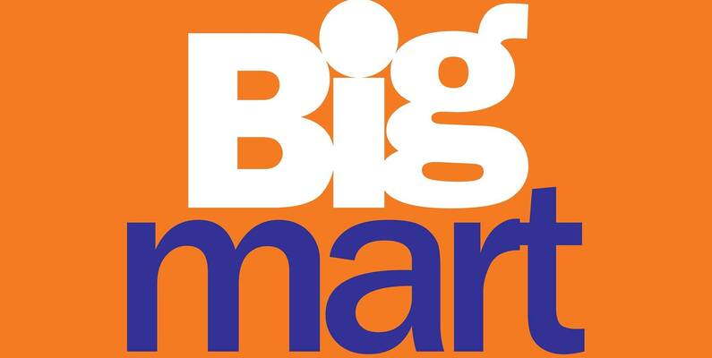
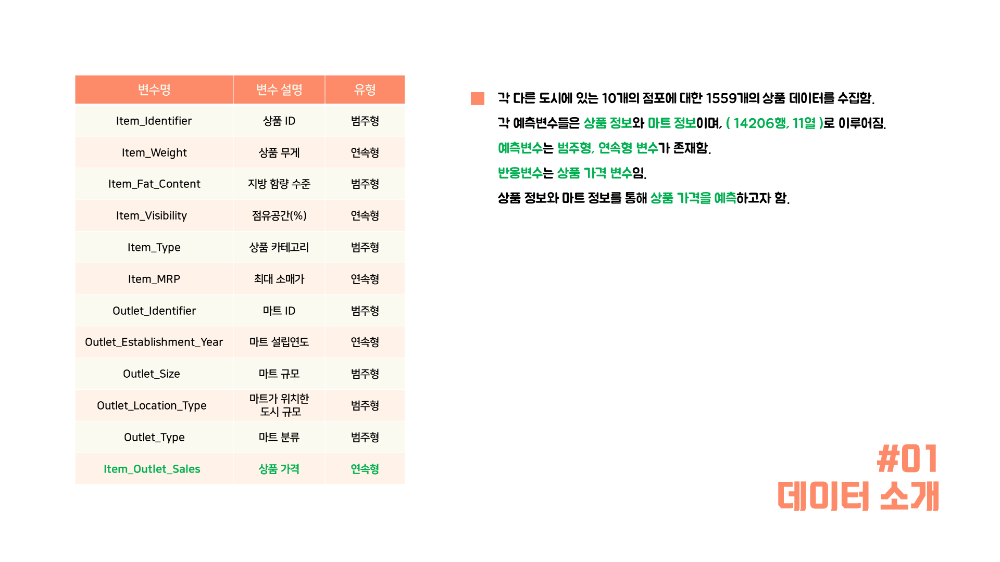
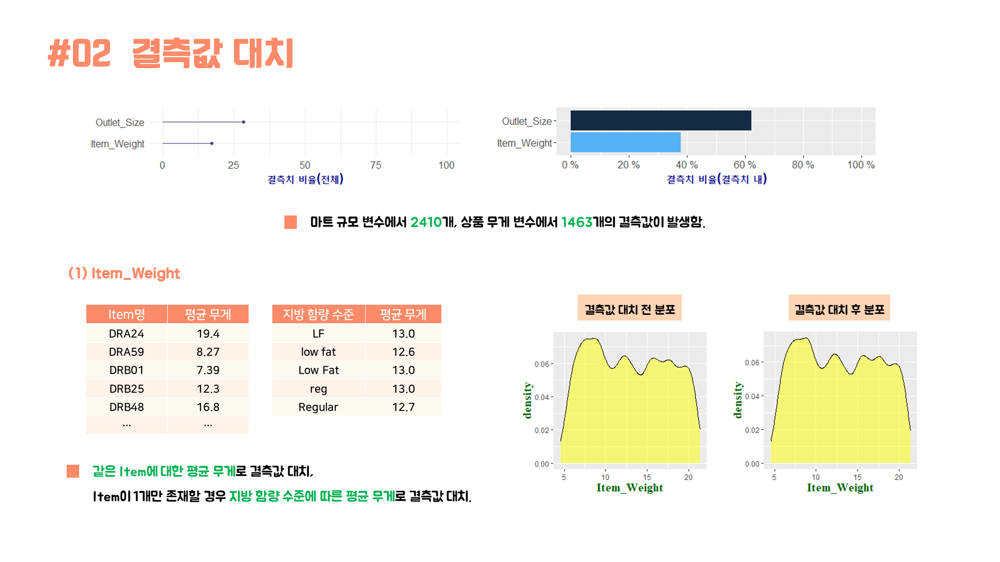
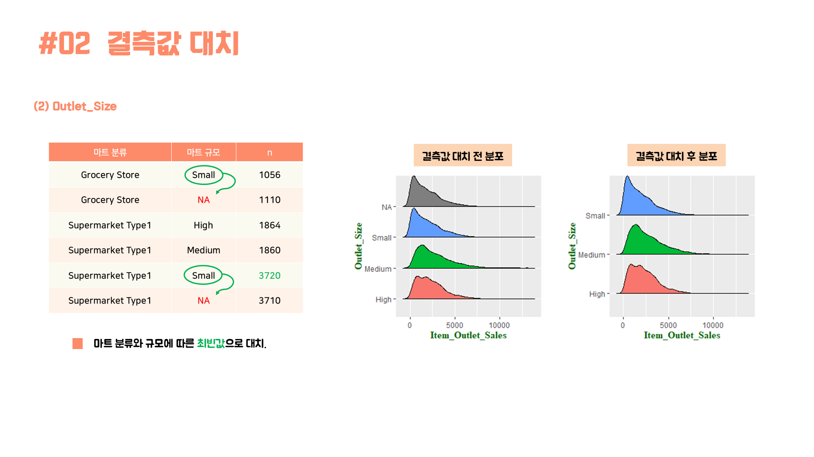
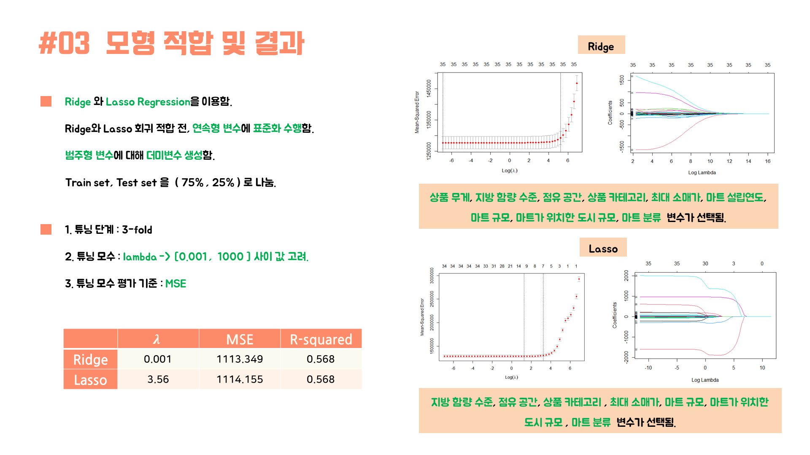

<h1 align="center"> 빅마트 제품 정보를 이용한 상품 가격 예측 </h1>

프로젝트에 대한 자세한 내용은 아래 링크에서 확인하실 수 있습니다:

🔗 [분석 보고서](https://eeyem.github.io/kaggle_bigmart/Project_bigmart_syj.html) 

)

## ✔️ 개요

- Kaggle에서 Big Mart Sales Prediction를 주제로 진행한 프로젝트입니다.
- 주제 : 기존의 마트 상품 정보를 이용하여 새 상품에 대한 가격을 예측
- 데이터 출처 : Kaggle, 각 다른 도시에 있는 10개의 점포에 대한 1559개의 상품 데이터
- 기여 내용 : 데이터 분석, 시각화, 교내 프로젝트 발표

## ✔️ 프로젝트 내용

### 결측값 대치

---

- 결측치가 발생한 상품 무게(Item_Identifier)와 마트 규모(Outlet_Size)변수에 대해 미기입인지, 누락인지 가설 수립 및 EDA를 통한 분석
    - 가설1 : 마트분류에 따라 규모가 제한될 수 있다. 이를 테면, 동네 슈퍼와 같은 경우 보편적으로 작게 운영되기 때문이다.
    - 가설2 : 같은 맥락에서 마트가 위치한 도시규모와 마트분류에 따라 규모가 제한될 수 있다.

가설에 대한 검정

- 연관성분석
    - 마트 규모와 마트 분류의 상관계수 (Cramer’s V)
    - 마트 규모와 마트가 위치한 도시규모의 상관계수 (Cramer’s V)

### 모형 구축

---

- 회귀분석
    - 더미화
    - Ridge, Lasso Regression 모형 구축
    - 모수(Hyperparameter) 튜닝

### 결론

---

- Ridge 회귀로 예측한 결과, test MSE는 339.87, Accuracy는 93%으로 측정되었습니다.
- Lasso 회귀로 예측한 결과, test MSE는 334.57, Accuracy는 93.3%으로 측정되었습니다.
- 문서자동화시스템인 Quarto로 제작
